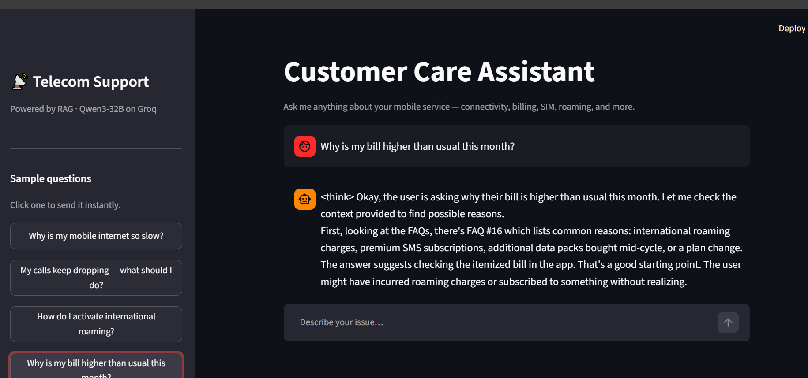
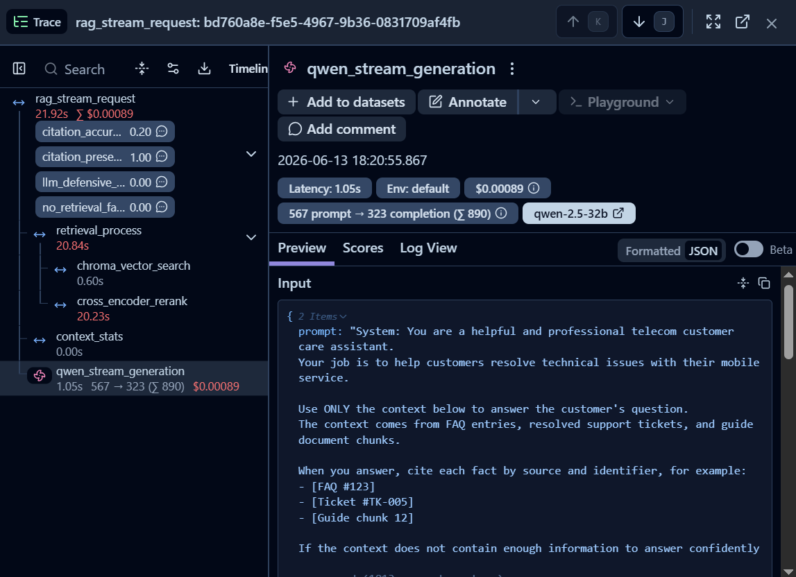
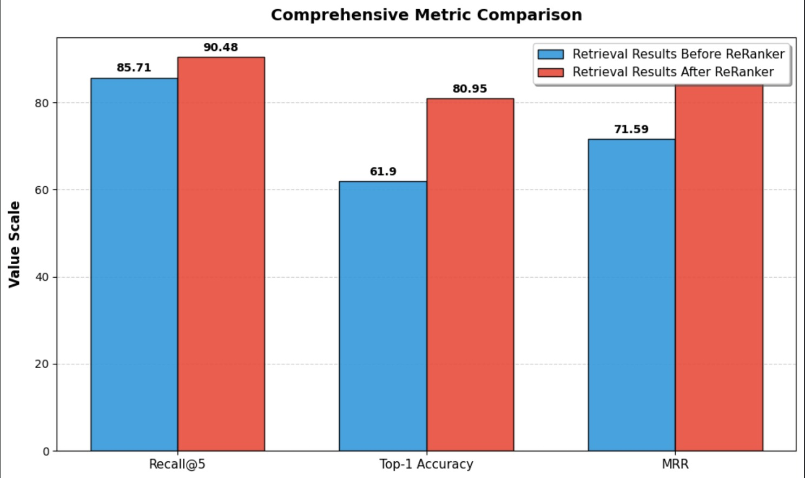

# Telecom Customer Support RAG Chatbot

A production-oriented Retrieval-Augmented Generation (RAG) system for telecom customer support built with LangChain, ChromaDB, Qwen 3-32B, Cross-Encoder reranking, LangFuse observability, automated evaluation, and GitHub Actions quality gates.

---

## Overview

This project simulates a telecom customer support assistant capable of answering customer questions using:

* FAQ knowledge base
* Historical resolved support tickets
* PDF troubleshooting and policy guides

The system retrieves relevant information, reranks results using a Cross-Encoder, generates grounded responses with citations, evaluates quality automatically, and enforces regression testing before code can be merged.

---

## Demo

### Chat Interface

The telecom assistant provides grounded responses using FAQs, support tickets, and troubleshooting guides.



## Architecture

```text
User Question
      │
      ▼
Multi-Collection Retriever
      │
      ├── FAQ Collection
      ├── Tickets Collection
      └── Guides Collection
      │
      ▼
Chroma Vector Search
      │
      ▼
Cross Encoder Reranker
(BAAI/bge-reranker-base)
      │
      ▼
Prompt Construction
      │
      ▼
Qwen3-32B (Groq)
      │
      ▼
Grounded Response + Citations
      │
      ▼
LangFuse Observability
```

---

## Features

### Retrieval Layer

* Multi-collection retrieval

  * FAQ collection
  * Support ticket collection
  * Guide chunk collection
* ChromaDB vector search
* Sentence Transformers embeddings
* Cosine similarity retrieval
* Distance threshold filtering

### Reranking Layer

* Cross Encoder reranking
* Model:

  * `BAAI/bge-reranker-base`
* Reorders retrieved documents based on semantic relevance
* Returns top-ranked documents for generation

### Generation Layer

* Model:

  * `Qwen3-32B`
  * Hosted on Groq
* Temperature = 0
* Source-grounded prompting
* Explicit citation requirements

Example citations:

```text
[FAQ #123]
[Ticket #TK-005]
[Guide chunk 12]
```

### Fallback Handling

When no supporting evidence is retrieved:

```text
"I'm sorry, I don't know the answer based on the available information.
Please call 611 or use the MyTelecom app for assistance."
```

---

## Observability & Monitoring

This project is fully instrumented using LangFuse.

### LangFuse Request Tracing

Every request is traced end-to-end including retrieval, reranking, generation, latency, and token usage.



### Request Tracing

Every request records:

* User question
* Retrieved documents
* Retrieval distances
* Cross Encoder scores
* Context size
* Prompt sent to LLM
* Generated answer
* Token consumption
* Latency measurements

### Retrieval Monitoring

Tracks:

* Retrieved document IDs
* Similarity distances
* Collection source
* Final reranked order

Example:

```text
Ticket TK-005
Distance: 0.21
Reranker Score: 0.98
```

### Latency Monitoring

Measured per request:

* Retrieval latency
* Reranker latency
* LLM latency
* Total request latency

Metrics tracked:

* P50 latency
* P95 latency
* P99 latency

### Citation Coverage

Automatically measures:

* Citation presence
* Citation accuracy
* Hallucinated citations

### Failure Tracking

Monitors:

* Empty retrieval failures
* LLM execution failures
* Defensive refusals
* Pipeline errors

### LLM-as-Judge Evaluation

LangFuse cloud evaluations are used to assess:

* Groundedness
* Context adherence
* Citation quality
* Response correctness

---

## Evaluation Framework

The project includes multiple evaluation layers.

### Layer 1 — Retrieval Evaluation

Measures retrieval quality before and after reranking.

Metrics:

* Recall@K
* Top-1 Accuracy
* MRR

### Retrieval Evaluation Results

The Cross Encoder significantly improved retrieval quality.

| Metric         | Before Reranker | After Reranker |
| -------------- | --------------- | -------------- |
| Recall@5       | 85.71%          | 90.48%         |
| Top-1 Accuracy | 61.90%          | 80.95%         |
| MRR            | 71.59%          | 84.29%         |



---

### Layer 2 — RAGAS Evaluation

End-to-end RAG quality evaluation.

Metrics:

* Faithfulness
* Answer Relevancy
* Context Precision
* Context Recall
* Answer Correctness

Results:

| Metric             | Score  |
| ------------------ | ------ |
| Faithfulness       | 0.7559 |
| Answer Relevancy   | 0.8302 |
| Context Precision  | 0.7901 |
| Context Recall     | 0.8635 |
| Answer Correctness | 0.4680 |

---

### Layer 3 — Structured Evaluation Reports

Individual evaluation samples are stored in tabular format for detailed analysis.

Example:

| Faithfulness | Answer Relevancy | Answer Correctness |
| ------------ | ---------------- | ------------------ |
| 1.0000       | 0.9008           | 0.7641             |
| 0.1667       | 0.6947           | 0.4936             |
| 0.6842       | 0.8338           | 0.3515             |

---

## Regression Gating

Every Pull Request automatically triggers quality validation.

### GitHub Actions Workflow

Workflow:

```text
Pull Request
      │
      ▼
GitHub Actions
      │
      ├── Build Vector Database
      ├── Retrieval Evaluation
      ├── Latency Evaluation
      ├── RAGAS Evaluation
      │
      ▼
Quality Gate
      │
      ├── PASS → Merge Allowed
      └── FAIL → Merge Blocked
```

### Quality Gates

The following automated tests are executed:

#### Gate 1 — Retrieval Uplift

Runs:

```text
tests/eval_retriever.py
```

Checks:

* Recall@K
* Top-1 Accuracy
* MRR

#### Gate 2 — Latency Validation

Runs:

```text
tests/eval_latency.py
```

Checks:

* P95 latency thresholds
* Production performance

#### Gate 3 — RAGAS Regression Testing

Runs:

```text
tests/eval_ragas.py
```

Checks:

* Faithfulness
* Relevancy
* Context Precision
* Context Recall

Builds fail automatically if thresholds are violated.

---

## Tech Stack

### LLM

* Qwen3-32B
* Groq

### Retrieval

* ChromaDB
* LangChain

### Embeddings

* sentence-transformers/all-MiniLM-L6-v2

### Reranking

* BAAI/bge-reranker-base

### Evaluation

* RAGAS
* Retrieval Benchmarks
* LangFuse LLM-as-Judge

### Observability

* LangFuse

### CI/CD

* GitHub Actions

---

## Project Structure

```text
.
├── app.py
├── rag_chain.py
├── retriever.py
├── observability.py
├── run_all_ingestion.py
├── assets/
│
├── tests/
│   ├── eval_retriever.py
│   ├── eval_ragas.py
│   ├── eval_latency.py
│   └── telecom_eval.json
│
├── ingests/
│
├── src/
│
└── .github/
    └── workflows/
        └── ci_rag_tests.yml
```

---

## Installation

### Requirements

* Python 3.11

### Install

```bash
pip install .
```

or

```bash
pip install -e .
```

---

## Environment Variables

```env
CHATBOT_GROQ_API_KEY=...

GROQ_API_KEY_1=...
GROQ_API_KEY_2=...

HF_TOKEN=...

LANGFUSE_PUBLIC_KEY=...
LANGFUSE_SECRET_KEY=...
LANGFUSE_HOST=https://cloud.langfuse.com
```

---

## Running the Project

### Build Vector Database

```bash
python run_all_ingestion.py
```

### Run Streamlit App

```bash
streamlit run app.py
```

### Run Retrieval Evaluation

```bash
python tests/eval_retriever.py
```

### Run RAGAS Evaluation

```bash
python tests/eval_ragas.py
```

### Run Latency Evaluation

```bash
python tests/eval_latency.py
```

---

## Future Improvements

* Hybrid Retrieval (BM25 + Dense Retrieval)
* Query Rewriting
* Conversational Memory
* Human Feedback Collection

```
```
